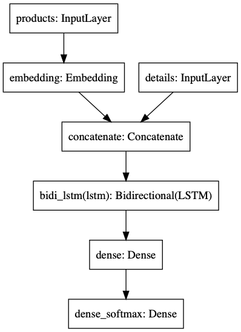
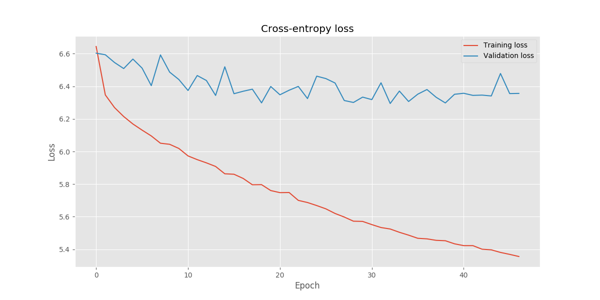
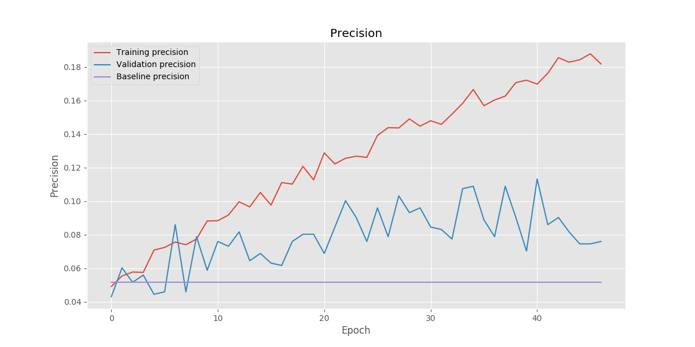
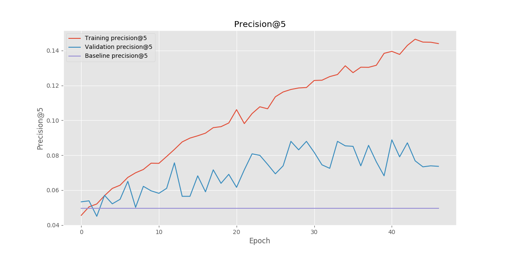

# Recommender


## Prerequisites

- Python 3.7+
- `pipenv`


## Usage

Use `pipenv` to download the required Python dependencies into a virtual environment.

```console
$ pipenv sync  # install dependencies
$ pipenv shell  # enter subshell in virtual environment
```

Use `python -m recommender.data` to preprocess the data:

```console
$ python -m recommender.data -h  # see options
$ python -m recommender.data -o data/processed -s val 0.1 \
  data/raw/events_train.csv data/raw/purchases_train.csv
```

To train the network, use `python -m recommender.train`:

```console
$ python -m recommender.train -h  # see options
$ python -m recommender.train -t train -v val -m models -l logs data/processed
```


## Preprocessing

The data is processed in several passes before being saved into the resulting files, that are ultimately used for training.


### Stage 1 – Retrieving customer IDs

The entire dataset is scanned for distinct customer IDs.
The number of occurrences of each customer in both view data and purchase data is counted.
Customers are then filtered by this metric, based on two criteria – the minimum number of purchased products and the minimum number of products occurring in any of the two types of events.
These parameters are provided upon invoking the pre-processing function.

*Example of the output:*

```
Retrieving customer IDs from events: 100%
2210171 customer IDs found in events.
Retrieving customer IDs from purchases: 100%
71566 customer IDs found in purchases.
206202 customers are above 10 events minimum
7560 customers are above 5 purchases minimum
Retrieved 6978 customer IDs in total.
```


### Stage 2 – Retrieving product IDs

In this stage, product IDs are gathered from the views and purchases of the customers retrieved in the previous step.
Products are filtered to have a minimum number of occurrences within the events of the selected customers.

*Example of the output:*

```
Retrieving product IDs from events: 100%
67877 product IDs found in events.
Retrieving product IDs from purchases: 100%
18122 product IDs found in purchases.
8053 products are above 20 occurrences minimum
Found 8053 product IDs in total.
```


### Stage 3 – Encoding time series

Finally, both views and purchases are filtered based on the resulting set of customers, in order to allow querying the data as separate time series.
The product IDs are encoded into new integer IDs if they belong into the filtered product set – otherwise they're encoded as having the ID of 0.

*Example of the output:*

```
Encoding time series from event data: 100%
Encoding time series from purchase data: 100%
Writing time series data: 100%
Writing time series index: 100%
Writing customer_ids.txt
Writing customer_ids.val.txt
Writing customer_ids.train.txt
Writing product_ids.txt
```


### Writing data to files

The data is written into the following files:

- `customer_ids.txt` – list of filtered customer IDs
- `customer_ids.train.txt` – list of filtered customer IDs in the training set
- `customer_ids.val.txt` – list of filtered customer IDs in the validation set
- `product_ids.txt` – list of filtered product IDs
- `series.csv` – concatenated time series of events for each customer
- `series.index.csv` – starting line number and length of each customer's series in `series.csv`

The time series have the following attributes:

- `timestamp` – Unix timestamp of the time of the event
- `product_id` – encoded ID of the product (0 if not encoded)
- `is_purchase` – type of event (1 if purchase, 0 if view)
- `price` – the price of the product at time of event


## Architecture

The recommendation model is at its core a neural network based around the LSTM architecture.



As the diagram shows, the model has its training data split into two inputs layers:

- **products** – the product IDs associated with event
- **details** – all the other attributes; namely time, event type, and price

The products inputs is passed through an embedding layer, the output of which is fed to the LSTM together with the details inputs.
The output of the LSTM – which is the hidden state at the last step – is then passed through two densely connected layers, the last one with a softmax activation to simulate a probabilty distribution.

During training, the true outputs come in as a vector of correctness of all products.
Each component of the vector corresponds to one of the encoded products.
The sum of the vector is always equal to 1, to correctly match with the softmax output layer.

The model was trained using the *Adam* optimizer with the loss function being the cross-entropy between the true and predicted vectors.
Two metrics were evaluated – precision and precision@5.


## Parameters

Both the data pre-processing and model training are highly parametrized to enable customization and fine-tuning of the solution.

Pre-processing parameters:

```
  -e MIN_EVENTS, --events MIN_EVENTS
                        minimum number of distinct products in events
                        (default: 10)
  -p MIN_PURCHASES, --purchases MIN_PURCHASES
                        minimum number of distinct purchased products
                        (default: 10)
  -P MIN_PRODUCTS, --products MIN_PRODUCTS
                        minimum number of product occurrences (default: 10)
  -s NAME SIZE, --subset NAME SIZE
                        specify additional subsets and their size (default:
                        None)
  -o OUTPUT_DIR, --output-dir OUTPUT_DIR
                        processed data directory (default: None)
```

The final solution uses the following values:

- `MIN_EVENTS`: 10
- `MIN_PURCHASES`: 5
- `MIN_PRODUCTS`: 20
- validation subset: 0.1

Training parameters:

```
  -e EMBEDDING_SIZE, --embedding EMBEDDING_SIZE
                        product embedding size
  -c ENCODER_SIZE, --encoder ENCODER_SIZE
                        encoder vector size
  -b BATCH_SIZE, --batch-size BATCH_SIZE
                        training batch size
  -r RECOMMENDATION_COUNT, --recommendations RECOMMENDATION_COUNT
                        number of recommendations to make
  -w VIEW_WEIGHT, --view-weight VIEW_WEIGHT
                        relative importance of a view
  -t TRAINING_SUBSET, --train-subset TRAINING_SUBSET
                        training subset identifier
  -v VALIDATION_SUBSET, --val-subset VALIDATION_SUBSET
                        validation subset identifier
  -m CHECKPOINT_DIR, --models-dir CHECKPOINT_DIR
                        model checkpoint directory
  -l LOG_DIR, --log-dir LOG_DIR
                        training logs directory

```

The final solution uses the following values:

- `EMBEDDING_SIZE`: 256
- `ENCODER_SIZE`: 256
- `BATCH_SIZE`: 32
- `RECOMMENDATION_COUNT`: 5
- `VIEW_WEIGHT`: 0.2


## Results

Compared to a baseline solution (overall most popular products), the model performs better at both metrics.

```
Precision: 11.318052 %
Precision_top_5: 8.882522 %
Baseline precision: 5.157593 %
Baseline precision_top_5: 4.957019 %
```






